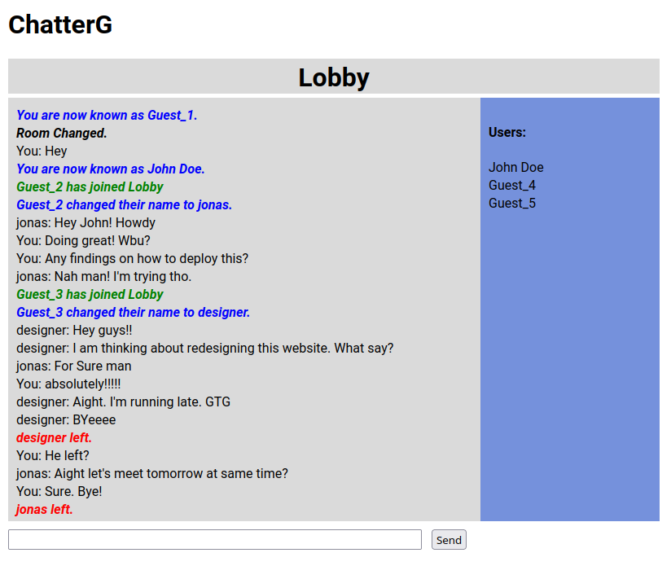

# ChatterG

This is a real-time chat application built with Socket.IO, where users can create rooms, change usernames, and communicate with others in the same room.

## Features

- Create and join chat rooms.
- Change your username within a room.
- Real-time messaging with other participants.
- User presence indication (online/offline status).
- Typing indicator to show when someone is typing.

## Technologies Used

- Node.js
- Socket.IO
- HTML/CSS/JavaScript

## Installation

1. Clone the repository:

    ```bash
    git clone https://github.com/your-username/socket-io-chat-app.git
    ```

2. Install Dependencies
    ```bash
    npm install
    ```

3. Start the server
    ```
    node server.js
    ```

4. Enjoy, Your chatting! Try opening it in different browser windows to simulate multi-user experience.

## Screenshots
